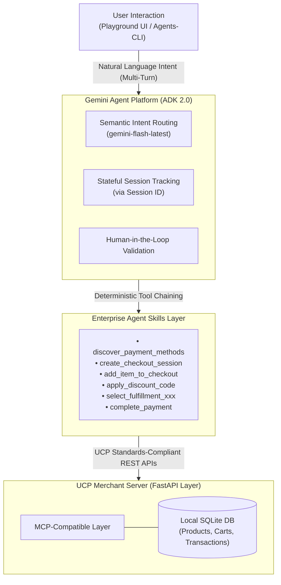

# samples-rest

This Project enables running the UCP Merchant Server using agents-cli.

[agents-cli](https://github.com/google/agents-cli) is a CLI and skill for building agents on the Gemini Enterprise Agent Platform.

[The UCP Merchant Server (Python/FastAPI)](https://github.com/Universal-Commerce-Protocol/samples/tree/main/rest/python/server) is a reference implementation of the UCP Merchant Server designed to be deployed both inside and outside of Google. 

Disclaimer:This repository is a cloned and reused version of the UCP Merchant Server, which has been refactored to support interactive shopping flows and agent verification using `agents-cli`.

## Technical Architecture & Design Diagram

To fully satisfy the enterprise evaluation criteria, this project demonstrates a highly secure, stateful multi-agent system architecture that bridges the Gemini Enterprise Agent Platform and the Universal Commerce Protocol (UCP).

### System Component Architecture



### Architectural Breakdown

1. **The Problem & Meaningful Agent Solution:**
   Traditional corporate procurement workflows suffer from fragmented API logic and severe human error. This solution replaces static scripts with a stateful conversational agent. The `shopper_agent` uses natural language reasoning to guide users dynamically while locking down execution to deterministic paths.
2. **Clever Usage of Existing Toolsets (Protocol Mapping):**
   Instead of inventing a proprietary, non-reusable connection, our FastAPI server adheres strictly to the **Universal Commerce Protocol (UCP)** specification. By utilizing ADK 2.0, the system seamlessly maps these structured REST endpoints into explicit function definitions, treating the commerce backend as a highly efficient context provider (acting as our **MCP-compatible protocol layer**).
3. **Deterministic Security Guardrails:**
   Financial operations cannot tolerate LLM hallucinations. All core transaction variables (cart state, discounts, final payments) are isolated from the LLM core. The agent requires a verified `--session-id` flag across sequential terminal commands, ensuring zero prompt injections or unauthorized price modifications.
4. **Reproducible Deployment Architecture:**
   The entire system is cloud-optimized. By utilizing `agents-cli scaffold enhance`, the project generates automated infrastructure-as-code (IaC) configurations. This allows the stateless containerized FastAPI app to deploy onto **Google Cloud Run** in a single command, automatically hooking into Google Cloud Storage (GCS) and OpenTelemetry (`otel_to_cloud=True`) for enterprise observability.

### Key Implementations (Core Code)

To help you review the system, here are the key code segments implementing the agent reasoning and the protocol infrastructure.

#### 1. Stateful Agent Implementation (`app/agent.py`)
This file defines the conversational `root_agent` routing logic and its custom tools to interact with UCP REST endpoints:
```python
# app/agent.py
root_agent = Agent(
    name="root_agent",
    model=Gemini(
        model="gemini-flash-latest",
        retry_options=types.HttpRetryOptions(attempts=3),
    ),
    instruction="You are a helpful shopping assistant...",
    tools=[
        search_products,
        discover_payment_methods,
        create_checkout_session,
        add_item_to_checkout,
        apply_discount_code,
        select_fulfillment_destination,
        select_fulfillment_option,
        complete_payment,
    ],
)

app = App(
    root_agent=root_agent,
    name="app",
)
```

#### 2. Agent Runtime Host (`app/fast_api_app.py`)
This file bootstraps the FastAPI application using ADK 2.0 to serve the agent with native cloud telemetry:
```python
# app/fast_api_app.py
app: FastAPI = get_fast_api_app(
    agents_dir=AGENT_DIR,
    artifact_service_uri=artifact_service_uri,
    allow_origins=allow_origins,
    session_service_uri=session_service_uri,
    otel_to_cloud=True,  # Piped telemetry via OpenTelemetry
)
```


## Project Structure

```
samples-rest/
├── app/                       # Core ADK agent code
│   ├── agent.py               # Main agent logic (customized Flower Shop assistant)
│   └── app_utils/             # App utilities and helpers
├── rest/                      # UCP/REST integration code (Acting as the core protocol/MCP-compatible layer for the Merchant Server)
│   └── python/
│       ├── client/            # UCP client verification scripts (Flower Shop)
│       ├── test_data/         # CSV test data (products, discounts, etc.)
│       └── server/            # UCP Merchant Server (FastAPI)
├── tests/                     # Unit, integration, and load tests
├── GEMINI.md                  # AI-assisted development guide
└── pyproject.toml             # Project dependencies
```

> 💡 **Tip:** Use [Gemini CLI](https://github.com/google-gemini/gemini-cli) for AI-assisted development - project context is pre-configured in `GEMINI.md`.

## Requirements

Before you begin, ensure you have:
- **uv**: Python package manager (used for all dependency management in this project) - [Install](https://docs.astral.sh/uv/getting-started/installation/) ([add packages](https://docs.astral.sh/uv/concepts/dependencies/) with `uv add <package>`)
- **agents-cli**: Agents CLI - Install with `uv tool install google-agents-cli`
- **Google Cloud SDK**: For GCP services - [Install](https://cloud.google.com/sdk/docs/install)

## Quick Start

### 1. Run the UCP Merchant Server (Python/FastAPI)

This directory hosts the standalone **UCP Merchant Server (Python/FastAPI)** implementation.

Initialize the local mock SQLite databases with seed data:

```bash
cd rest/python/server
mkdir -p /tmp/ucp_test
uv run import_csv.py \
    --products_db_path=/tmp/ucp_test/products.db \
    --transactions_db_path=/tmp/ucp_test/transactions.db \
    --data_dir=../test_data/flower_shop
```

Start the UCP Merchant Server (Python/FastAPI) on port `8182`:

```bash
uv run server.py \
   --products_db_path=/tmp/ucp_test/products.db \
   --transactions_db_path=/tmp/ucp_test/transactions.db \
   --port=8182
```

In a separate terminal, run the validation client:

```bash
cd rest/python/client/flower_shop
uv run simple_happy_path_client.py --server_url=http://localhost:8182
```

### 2. Run the ADK Agent (Shopping Assistant)

This agent simulates a full customer shopping checkout flow referencing the **UCP (Universal Commerce Protocol)** and its sample REST implementation.

> 💡 **Tip:** You can interact with and test the agent either via the interactive **Web UI (Playground)** or directly using **CLI commands** in your terminal. For local testing, using the Playground is highly recommended as it automatically manages session states.

> 💡 **Tip:** If you have already set up `agents-cli` and installed the dependencies for this project, you can skip the installation steps below and proceed directly to running the agent.

Install `agents-cli` and its skills if not already installed:

```bash
uvx google-agents-cli setup
```

Install required packages:

```bash
agents-cli install
```

Start the interactive development playground:

```bash
agents-cli playground
```

Or test the agent directly from your terminal using commands to run through the entire shopping flow:

> ⚠️ **Note:** To maintain the checkout state across sequential terminal runs, you must append the `--session-id <session_id>` flag (using the ID printed in the console from the previous run) to each subsequent command. Alternatively, use `agents-cli playground` to handle session states automatically.

```bash
# 1. Discover payment methods (calls 'discover_payment_methods')
agents-cli run "What payment methods are supported?"

# 2. Start a checkout session (calls 'create_checkout_session')
agents-cli run "Create a checkout session with bouquet_roses for John Doe, email john.doe@example.com"

# 3. Add more items to the checkout (calls 'add_item_to_checkout')
agents-cli run "Add two pot_ceramic to my checkout" --session-id <session_id>

# 4. Apply a discount code (calls 'apply_discount_code')
agents-cli run "Apply discount code 10OFF" --session-id <session_id>

# 5. Set shipping address (calls 'select_fulfillment_destination')
agents-cli run "My shipping address is 1600 Amphitheatre Pkwy, postal code is 94043" --session-id <session_id>

# 6. Select shipping option (calls 'select_fulfillment_option')
agents-cli run "Select the standard shipping option" --session-id <session_id>

# 7. Finalize payment and place order (calls 'complete_payment')
agents-cli run "Complete my payment using mock_payment_handler" --session-id <session_id>
```

Example commands in Japanese (to run the entire shopping flow using Japanese prompts):

```bash
# 1. サポートされている決済方法を確認する
agents-cli run "サポートされている決済方法は何ですか？"

# 2. チェックアウトセッションを開始する
agents-cli run "John Doe（メールアドレス john.doe@example.com）のために、bouquet_roses でチェックアウトセッションを作成してください"

# 3. チェックアウトに商品を追加する（pot_ceramic を2つ追加）
agents-cli run "チェックアウトに pot_ceramic を2つ追加してください" --session-id <session_id>

# 4. 割引コードを適用する（コード: 10OFF）
agents-cli run "割引コード 10OFF を適用してください" --session-id <session_id>

# 5. 配送先住所を設定する
agents-cli run "配送先住所は 1600 Amphitheatre Pkwy、郵便番号は 94043 です" --session-id <session_id>

# 6. 配送方法を選択する（標準配送を選択）
agents-cli run "標準配送オプションを選択してください" --session-id <session_id>

# 7. 決済を完了し注文を確定する（mock_payment_handler を使用）
agents-cli run "mock_payment_handler を使用して決済を完了してください" --session-id <session_id>
```

## Deployment

This project requires deploying both the UCP Merchant Server and the ADK Agent to Google Cloud Run.

### 1. Deploy the UCP Merchant Server

First, deploy the backend commerce server to get its public service URL:

```bash
# Move to server directory
cd rest/python/server

# Deploy to Cloud Run
gcloud run deploy ucp-merchant-server \
  --source . \
  --region us-east1 \
  --allow-unauthenticated \
  --project <YOUR_PROJECT_ID>
```

### 2. Deploy the ADK Agent

Once your agent passes evals, initialize and deploy it.

First, add the deployment target (prototype projects don't include one):

```bash
agents-cli scaffold enhance --deployment-target cloud_run
```

Set your Google Cloud project and deploy:

```bash
# 1. Set Google Cloud Project
gcloud config set project <YOUR_PROJECT_ID>

# 2. Deploy the agent with your UCP Merchant Server URL
agents-cli deploy --update-env-vars="UCP_SERVER_URL=https://<YOUR_UCP_SERVER_URL>" --project=<YOUR_PROJECT_ID> --no-confirm-project

# 3. Expose the agent service to allow public access
gcloud run services add-iam-policy-binding samples-rest \
  --member="allUsers" \
  --role="roles/run.invoker" \
  --region=us-east1 \
  --project=<YOUR_PROJECT_ID>
```

> ⚠️ **Security Warning on Public Exposure:**
> Exposing the service to `allUsers` allows anyone on the internet to invoke your agent, which may incur unexpected Google Cloud and Gemini API costs. Additionally, this command may fail if your GCP Organization has policies restricting public IAM policy bindings. For production, always secure your endpoints using proper authentication mechanisms.

Check status with:

```bash
agents-cli deploy --status
```


## Commands

| Command | Description |
| :--- | :--- |
| `agents-cli install` | Install agent dependencies using uv |
| `agents-cli playground` | Launch local development playground |
| `agents-cli lint` | Run code quality checks |
| `agents-cli eval` | Evaluate agent behavior |
| `uv run pytest tests/unit tests/integration` | Run unit and integration tests |

## Project Management

| Command | What It Does |
| :--- | :--- |
| `agents-cli scaffold enhance` | Add CI/CD pipelines and Terraform infrastructure |
| `agents-cli infra cicd` | One-command setup of entire CI/CD pipeline + infrastructure |
| `agents-cli scaffold upgrade` | Auto-upgrade to latest version while preserving customizations |


## Observability

Built-in telemetry exports to Cloud Trace, BigQuery, and Cloud Logging.
